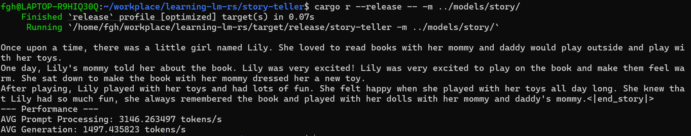
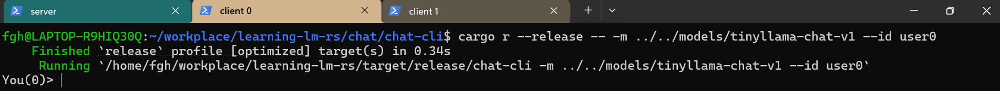
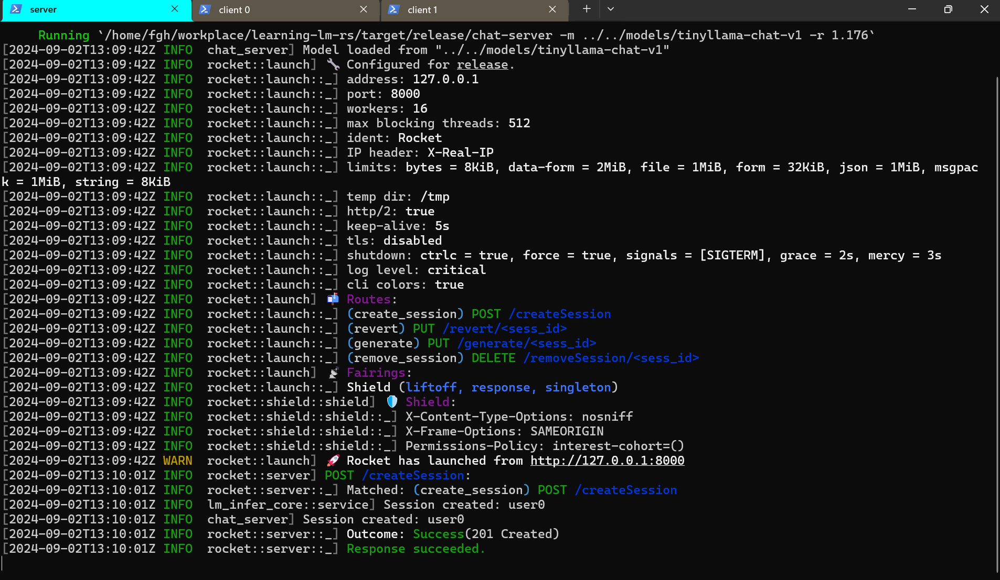
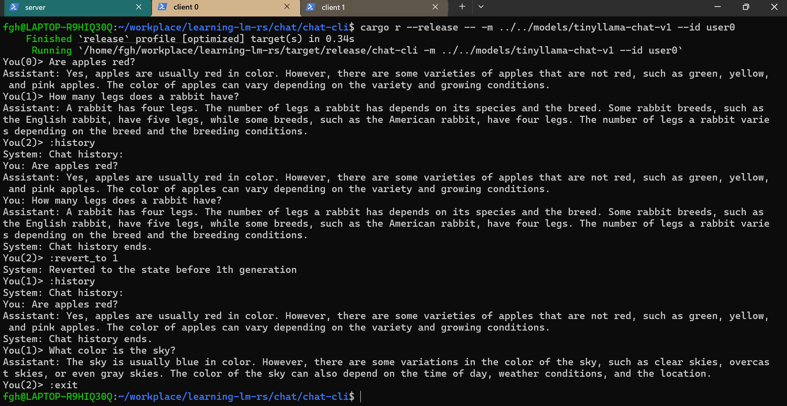
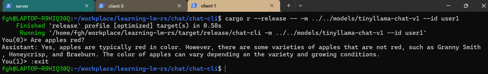
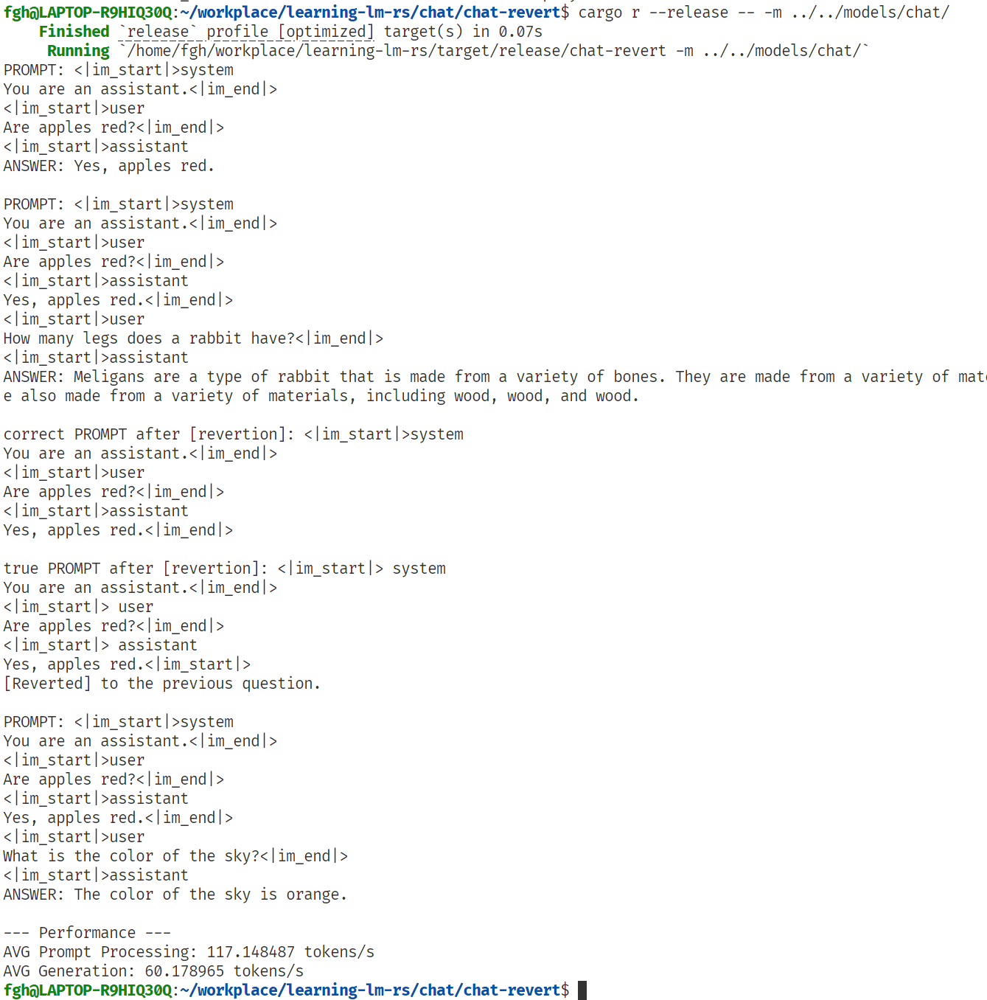

[Instructions](./doc/Instructions.md)

# 讲故事

```bash
cd story-teller
cargo r --release -- -m ../models/story/
```



# 对话服务

## 模型文件

- chat: [Felladrin/Minueza-32M-UltraChat](https://github.com/LearningInfiniTensor/learning-lm-rs/releases/download/v0.0.0/chat.zip)
- tinyllama-chat-v1: [tinyllama chat v1](https://huggingface.co/TinyLlama/TinyLlama-1.1B-Chat-v1.0)

放置于`models`目录下，分别命名。

## 启动

### Server

Server基于[rocket](https://rocket.rs/), listening on http://localhost:8000.
- chat模型（`models/chat` 数据类型：`f32`）
```bash
cd chat/chat-server
RUST_LOG=info cargo r --release -- -m ../../models/chat -r 1.176
```
- TinyLlama模型（`tinyllama-chat-v1` 数据类型：`bf16`）: 由于我写的代码不支持动态配置模型数据类型，所以在运行前需要手动修改一行: `chat/chat-server/src/main.rs`中`ModelParamType`改为`half:bf16`。
```bash
cd chat/chat-server
RUST_LOG=info cargo r --release --features rayon -- -m ../../models/tinyllama-chat-v1 -r 1.176
```

`-r`是repetition penalty，去掉其则会跳过这一过程。其他参数配置请见`cargo r --release -- -h`。

### Clients

```bash
cd chat/chat-cli
# chat
cargo r --release -- -m ../../models/chat --id user0
# or, tinyllama
cargo r --release -- -m ../../models/tinyllama-chat-v1 --id user0
```

可以启动多个具有不同id的client。

## 多会话对话服务

初始状态：启动Server后，启动Client 0。



可在Server的日志中查看服务请求处理次序。此时，Server端已经创建了Client0的session。



依次进行如下操作：

1. Client0输入问题，触发Server`/generate`，得到回复；
1. Client0输入问题，触发Server`/generate`，得到回复；
1. Client0通过`:history`命令查看过往对话；
1. Client0通过`:revert_to 1`命令回退对话状态至第二次对话前，触发Server`/revert`（注意到，`You(<ith>)`的数字为1，意为用户下次输入的是第二个问题）;；
1. Client0通过`:history`命令查看过往对话，注意到历史中只有第一个和第三个问答；
1. Client1以`user1`为`session id`启动，触发Server`/createSession`。
1. Client1输入问题，触发Server`/generate`，得到回复；
1. Client0通过`:exit`退出；
1. Client1通过`:exit`退出；

完整Client0输出:



完整Client1输出:


<details>
<summary>完整Server端日志</summary>
<pre><code>
fgh@LAPTOP-R9HIQ30Q:~/workplace/learning-lm-rs/chat/chat-server$ RUST_LOG=info cargo r --release --features rayon -- -m ../../models/tinyllama-chat-v1 -r 1.176
    Finished `release` profile [optimized] target(s) in 0.45s
     Running `/home/fgh/workplace/learning-lm-rs/target/release/chat-server -m ../../models/tinyllama-chat-v1 -r 1.176`
[2024-09-02T13:09:42Z INFO  chat_server] Model loaded from "../../models/tinyllama-chat-v1"
[2024-09-02T13:09:42Z INFO  rocket::launch] 🔧 Configured for release.
[2024-09-02T13:09:42Z INFO  rocket::launch::_] address: 127.0.0.1
[2024-09-02T13:09:42Z INFO  rocket::launch::_] port: 8000
[2024-09-02T13:09:42Z INFO  rocket::launch::_] workers: 16
[2024-09-02T13:09:42Z INFO  rocket::launch::_] max blocking threads: 512
[2024-09-02T13:09:42Z INFO  rocket::launch::_] ident: Rocket
[2024-09-02T13:09:42Z INFO  rocket::launch::_] IP header: X-Real-IP
[2024-09-02T13:09:42Z INFO  rocket::launch::_] limits: bytes = 8KiB, data-form = 2MiB, file = 1MiB, form = 32KiB, json = 1MiB, msgpack = 1MiB, string = 8KiB
[2024-09-02T13:09:42Z INFO  rocket::launch::_] temp dir: /tmp
[2024-09-02T13:09:42Z INFO  rocket::launch::_] http/2: true
[2024-09-02T13:09:42Z INFO  rocket::launch::_] keep-alive: 5s
[2024-09-02T13:09:42Z INFO  rocket::launch::_] tls: disabled
[2024-09-02T13:09:42Z INFO  rocket::launch::_] shutdown: ctrlc = true, force = true, signals = [SIGTERM], grace = 2s, mercy = 3s
[2024-09-02T13:09:42Z INFO  rocket::launch::_] log level: critical
[2024-09-02T13:09:42Z INFO  rocket::launch::_] cli colors: true
[2024-09-02T13:09:42Z INFO  rocket::launch] 📬 Routes:
[2024-09-02T13:09:42Z INFO  rocket::launch::_] (create_session) POST /createSession
[2024-09-02T13:09:42Z INFO  rocket::launch::_] (revert) PUT /revert/<sess_id>
[2024-09-02T13:09:42Z INFO  rocket::launch::_] (generate) PUT /generate/<sess_id>
[2024-09-02T13:09:42Z INFO  rocket::launch::_] (remove_session) DELETE /removeSession/<sess_id>
[2024-09-02T13:09:42Z INFO  rocket::launch] 📡 Fairings:
[2024-09-02T13:09:42Z INFO  rocket::launch::_] Shield (liftoff, response, singleton)
[2024-09-02T13:09:42Z INFO  rocket::shield::shield] 🛡️ Shield:
[2024-09-02T13:09:42Z INFO  rocket::shield::shield::_] X-Content-Type-Options: nosniff
[2024-09-02T13:09:42Z INFO  rocket::shield::shield::_] X-Frame-Options: SAMEORIGIN
[2024-09-02T13:09:42Z INFO  rocket::shield::shield::_] Permissions-Policy: interest-cohort=()
[2024-09-02T13:09:42Z WARN  rocket::launch] 🚀 Rocket has launched from http://127.0.0.1:8000
[2024-09-02T13:10:01Z INFO  rocket::server] POST /createSession:
[2024-09-02T13:10:01Z INFO  rocket::server::_] Matched: (create_session) POST /createSession
[2024-09-02T13:10:01Z INFO  lm_infer_core::service] Session created: user0
[2024-09-02T13:10:01Z INFO  chat_server] Session created: user0
[2024-09-02T13:10:01Z INFO  rocket::server::_] Outcome: Success(201 Created)
[2024-09-02T13:10:01Z INFO  rocket::server::_] Response succeeded.
[2024-09-02T13:15:24Z INFO  rocket::server] PUT /generate/user0:
[2024-09-02T13:15:24Z INFO  rocket::server::_] Matched: (generate) PUT /generate/<sess_id>
[2024-09-02T13:17:07Z INFO  chat_server] Generated tokens for session user0
[2024-09-02T13:17:07Z INFO  rocket::server::_] Outcome: Success(200 OK)
[2024-09-02T13:17:07Z INFO  rocket::server::_] Response succeeded.
[2024-09-02T13:21:20Z INFO  rocket::server] PUT /generate/user0:
[2024-09-02T13:21:20Z INFO  rocket::server::_] Matched: (generate) PUT /generate/<sess_id>
[2024-09-02T13:24:42Z INFO  chat_server] Generated tokens for session user0
[2024-09-02T13:24:42Z INFO  rocket::server::_] Outcome: Success(200 OK)
[2024-09-02T13:24:42Z INFO  rocket::server::_] Response succeeded.
[2024-09-02T13:26:14Z INFO  rocket::server] PUT /revert/user0:
[2024-09-02T13:26:14Z INFO  rocket::server::_] Matched: (revert) PUT /revert/<sess_id>
[2024-09-02T13:26:14Z INFO  chat_server] Revert session user0 to the state before 1th generation
[2024-09-02T13:26:14Z INFO  rocket::server::_] Outcome: Success(200 OK)
[2024-09-02T13:26:14Z INFO  rocket::server::_] Response succeeded.
[2024-09-02T13:27:24Z INFO  rocket::server] PUT /generate/user0:
[2024-09-02T13:27:24Z INFO  rocket::server::_] Matched: (generate) PUT /generate/<sess_id>
[2024-09-02T13:30:12Z INFO  chat_server] Generated tokens for session user0
[2024-09-02T13:30:12Z INFO  rocket::server::_] Outcome: Success(200 OK)
[2024-09-02T13:30:12Z INFO  rocket::server::_] Response succeeded.
[2024-09-02T13:30:45Z INFO  rocket::server] POST /createSession:
[2024-09-02T13:30:45Z INFO  rocket::server::_] Matched: (create_session) POST /createSession
[2024-09-02T13:30:45Z INFO  lm_infer_core::service] Session created: user1
[2024-09-02T13:30:45Z INFO  chat_server] Session created: user1
[2024-09-02T13:30:45Z INFO  rocket::server::_] Outcome: Success(201 Created)
[2024-09-02T13:30:45Z INFO  rocket::server::_] Response succeeded.
[2024-09-02T13:31:35Z INFO  rocket::server] PUT /generate/user1:
[2024-09-02T13:31:35Z INFO  rocket::server::_] Matched: (generate) PUT /generate/<sess_id>
[2024-09-02T13:33:54Z INFO  chat_server] Generated tokens for session user1
[2024-09-02T13:33:54Z INFO  rocket::server::_] Outcome: Success(200 OK)
[2024-09-02T13:33:54Z INFO  rocket::server::_] Response succeeded.
^C[2024-09-02T13:37:57Z WARN  rocket::server] Received SIGINT. Requesting shutdown.
[2024-09-02T13:37:57Z INFO  rocket::server] Shutdown requested. Waiting for pending I/O...
[2024-09-02T13:37:57Z INFO  rocket::server] Graceful shutdown completed successfully.
fgh@LAPTOP-R9HIQ30Q:~/workplace/learning-lm-rs/chat/chat-server$
</code></pre>
</details>

## 会话回滚

在对话服务中，可以使用`:revert_to <ith>`命令来返回至指定问答前状态。

除此之外，这有一个简单的本地验证：
```bash
cd chat/chat-revert
cargo r --release -- -m ../../models/chat/
```

验证结果：对比下图中`correct PROMPT after [revertion]`和`true PROMPT after [revertion]`.



# 测试

- 添加各数据类型在各泛型算子上的简单测试。
- 重写KvCache，添加Tensor和sliced kvcache的视图读写trait，添加单元测试。
- 通过rayon并行化部分算子，添加单元测试。

```bash
cargo t
cargo t --features rayon
```
